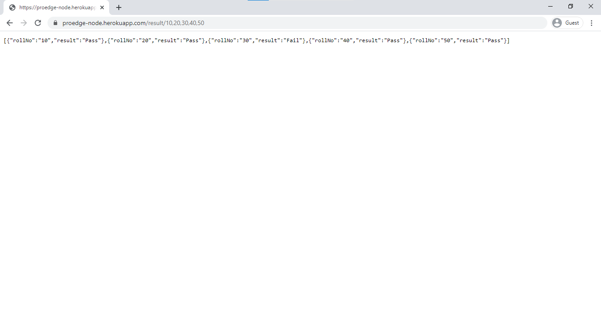

# Proedge NodeJS Assignment
https://proedge-node.herokuapp.com/result/10

Framework used: Express

Modules/Packages used:  
• HTTP - To make API call to http://proedge.me/test.php?rollnumber= 
• CORS - To avoid CORS blocking 
• Async - To make multiple API calls at the same time to reduce response time. 

Test Cases: 
1. 10 

2. 10,20,30,40,50

3. 5,6,9,12,18,20,25,30,32,36,37,38,40,42,45

